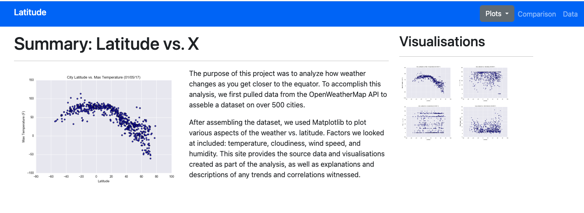
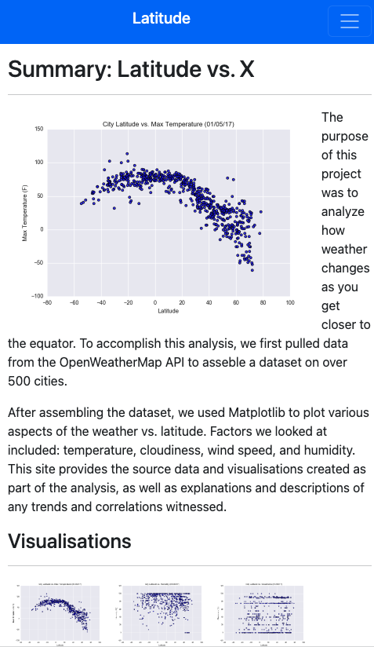
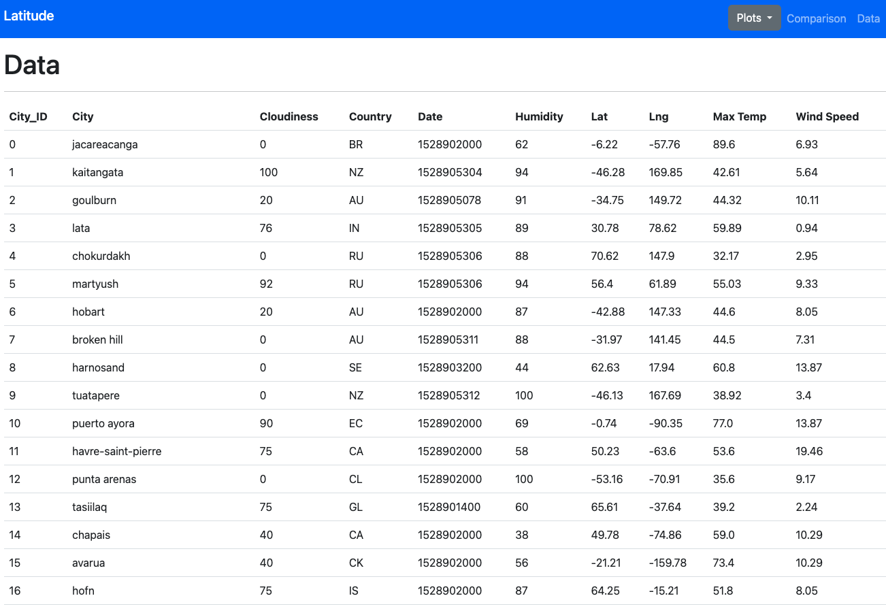
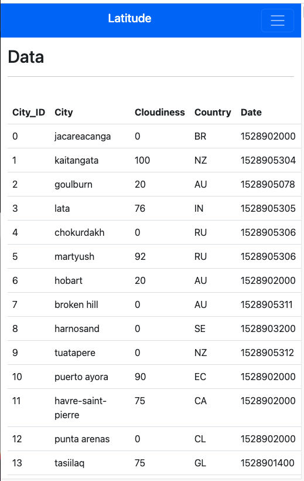
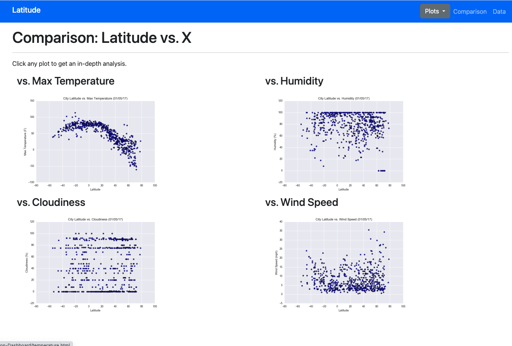
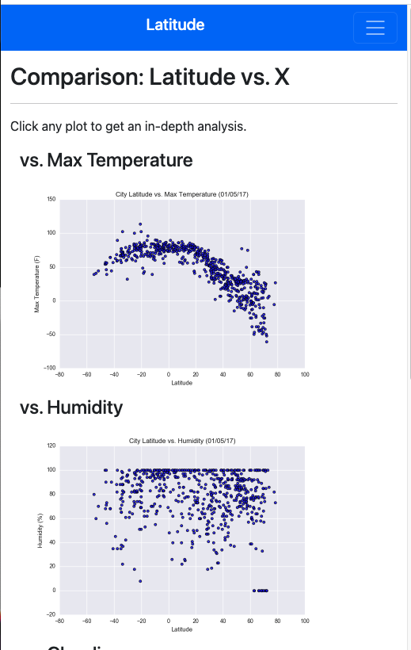
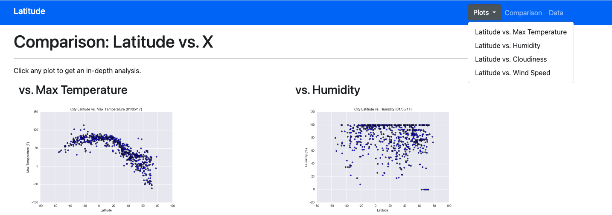
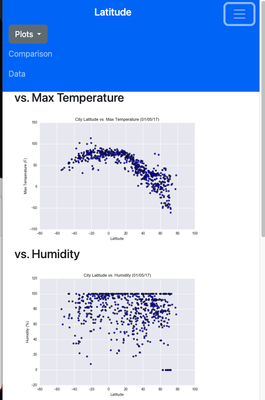
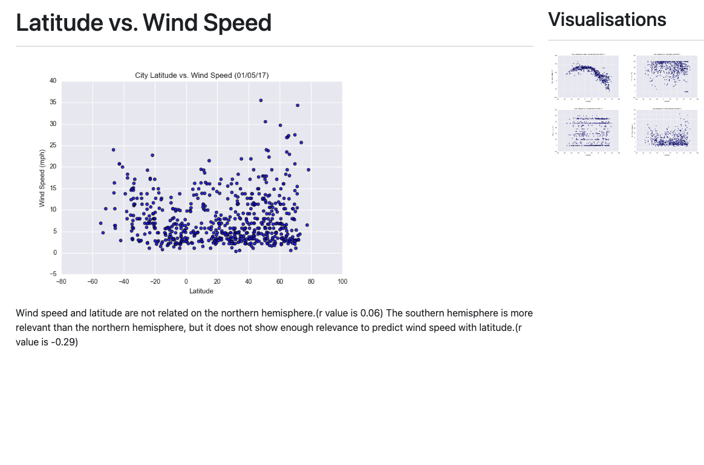
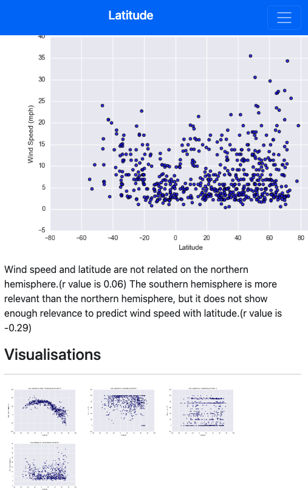

# Web Visualization Dashboard
***
## Introduction

- I created individual pages for each plot and a means by which I can navigate between them. These pages contain the visualizations and their corresponding explanations. It also have a landing page, a page where you can see a comparison of all of the plots, and another page where you can view the data used to build them.

***
## The structure of a website
1. A landing page containing:

> - An explanation of the project.
> - Links to each visualizations page. There are a sidebar containing preview images of each plot, and clicking an image can take the user to that visualization.

2. Four visualization pages, each with:

> - A descriptive title and heading tag.
> - The plot/visualization itself for the selected comparison.
> - A paragraph describing the plot and its significance.

3. A "Comparisons" page that:

> - Contains all of the visualizations on the same page so we can easily visually compare them.
> - Used a Bootstrap grid for the visualizations. And that grid is two visualizations across on screens medium and larger, and 1 across on extra-small and small screens.

4. A  "Data" page that:

> - Displays a responsive table containing the data used in the visualizations.
> - The table has a bootstrap table component. 
> - The data came from exporting the .csv file as HTML using a pandas.

## Finally, the website deployed to GitHub pages.
***
- Landing Page : https://nathanunghwan.github.io/Web-Visualization-Dashboard/

1. Landing page

2. Data page

3. Comparison page

4. Navigation

5. Visuallize

